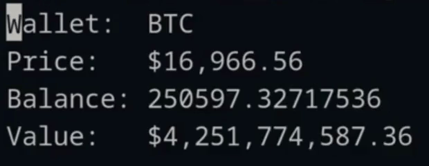

  <!--  -->
   
  <h1>Node.js Kafka Example</h1>
  
Realtime Bitcoin Wallet Tracker Example App with Node.js and Kafka

  

# Features

- Interact with Kafka through Node.js
- Produce/consume events to/from topics
- Use Kafka as a queue and as a publish/subscribe system
- Kafka with Zookeeper and without Zookeeper using Redpanda
- Make use of Kafka's partitioning ability

# Tech Stack

- [Node.js](https://nodejs.org)
- [TypeScript](https://www.typescriptlang.org)
- [Docker](https://www.docker.com)
- [Kafka](https://kafka.apache.org)
- [Redpanda](https://github.com/redpanda-data/redpanda)
- [WebSockets](https://github.com/websockets/ws)

# Usage

**Recommended OS**: Linux

**Requirements**: Node.js, Docker, Docker Compose

**Setup**

- `npm install` (Install NPM dependencies)
- `docker-compose -f docker-compose.yaml up --build` (Start services)
- Optionally set environment variables in [`.env`](.env):
  - `BLOCKCYPHER_TOKEN` (https://accounts.blockcypher.com/tokens)

**Run**

- `npx ts-node cli.ts <WALLET_ADDRESS>` (Watch a BTC or ETH wallet)
  - `npx ts-node cli.ts 34xp4vRoCGJym3xR7yCVPFHoCNxv4Twseo` (Watch a BTC wallet)
  - `npx ts-node cli.ts 0xBE0eB53F46cd790Cd13851d5EFf43D12404d33E8` (Watch an ETH wallet)

**Monitoring**

- http://localhost:8080 (Redpanda Console)

**Notes**

- Fetching the balance might stop working at some point, because [Blockcypher](https://www.blockcypher.com) limits the amount of requests one can send to their API

**Cleanup**

- `docker-compose -f docker-compose.yaml rm -s -f -v` (Stop and remove Docker containers)

# Example

- `npm install` (Install NPM dependencies)
- `docker-compose -f example.docker-compose.yaml up --build` (Start example)
- `docker-compose -f example.docker-compose.yaml rm -s -f -v` (Clean example)

# Codebase

- [`example.ts`](example.ts) (Minimal example of using Kafka with Node.js)
- [`cli.ts`](cli.ts) (CLI application to read wallet data in realtime)
- [`server.ts`](server.ts) (WebSocket server that communicates with CLI and with Kafka)
- [`balance.ts`](balance.ts) (Service, that crawls wallet balance on demand)
- [`price.ts`](price.ts) (Service, that writes realtime price events to Kafka)
